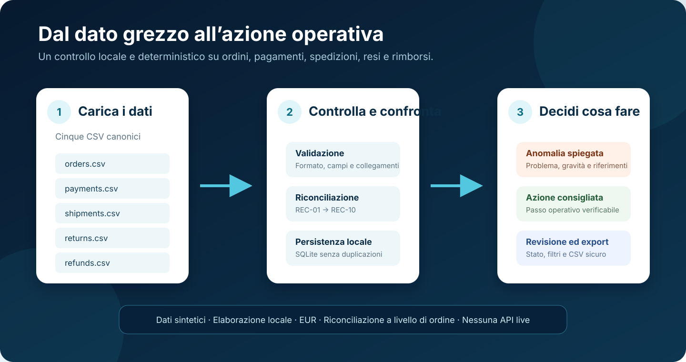
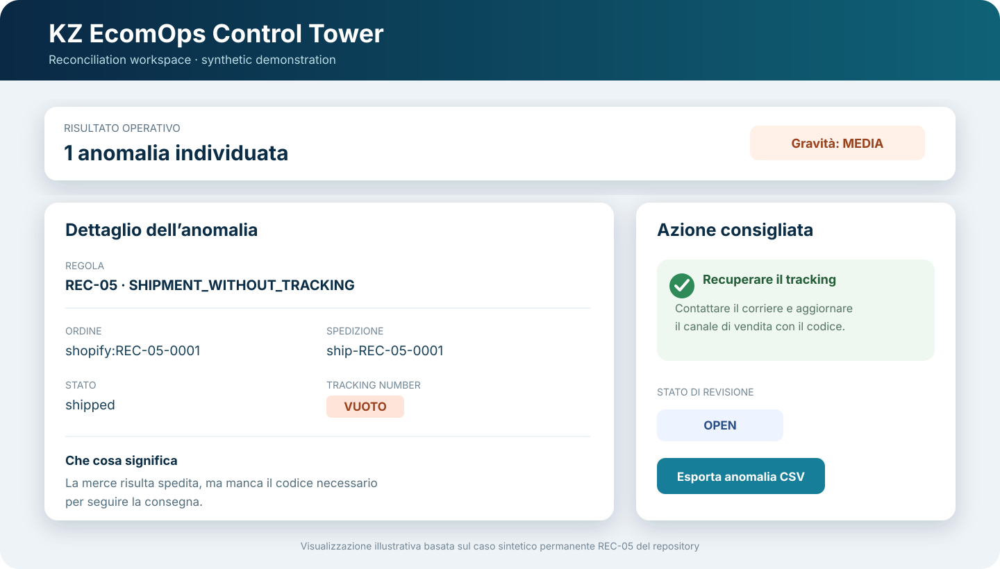

# KZ EcomOps Control Tower

**Un prototipo locale che confronta ordini, pagamenti, spedizioni, resi e rimborsi e trasforma le differenze in azioni operative comprensibili.**

[English version](#english-version) · [Guida alla demo](docs/DEMO_GUIDE.md) · [Architettura](docs/ARCHITECTURE.md) · [Dizionario dati](docs/DATA_DICTIONARY.md)

> **Nota sul progetto**
> Questo è un MVP indipendente realizzato per portfolio. Tutti i dati inclusi sono sintetici. Non utilizza dati aziendali reali e non è collegato alle API ufficiali di Shopify, WooCommerce, Amazon o eBay.



## Che problema risolve

In un e-commerce lo stesso ordine lascia informazioni in più punti:

- l’ordine dice quanto deve pagare il cliente;
- il pagamento dice quanto è stato realmente incassato;
- la spedizione dice se la merce è partita e se possiede un tracking;
- il reso dice se il prodotto è rientrato;
- il rimborso dice quanto è stato restituito al cliente.

Quando questi dati non coincidono, il controllo manuale richiede tempo e può nascondere errori operativi o economici. KZ EcomOps Control Tower riunisce i cinque flussi, li controlla con regole chiare e indica **che cosa non torna, perché è importante e quale verifica eseguire**.

## Come funziona, in parole semplici

1. L’utente carica cinque file CSV: `orders.csv`, `payments.csv`, `shipments.csv`, `returns.csv` e `refunds.csv`.
2. L’app controlla che i file abbiano struttura, valori e collegamenti corretti.
3. I record vengono associati tramite identificatori stabili, principalmente l’ordine.
4. Dieci regole deterministiche cercano differenze operative e finanziarie.
5. Ogni anomalia mostra gravità, dati confrontati, record coinvolti e azione consigliata.
6. L’utente può filtrare i risultati, aggiornare lo stato della revisione ed esportare il risultato visibile in CSV.

Il programma non “indovina” e non usa un modello di intelligenza artificiale per decidere. A parità di dati e configurazione produce lo stesso risultato, quindi ogni segnalazione è ripetibile e verificabile.

## Esempio concreto: spedizione senza tracking

Nel sample `REC-05` una spedizione risulta già partita, ma il campo del tracking è vuoto. L’app non cancella il record e non blocca l’intero caricamento: conserva l’informazione e genera una segnalazione operativa.



Il risultato indica:

- **problema:** la merce è partita senza un codice di tracciamento registrato;
- **gravità:** media;
- **ordine e spedizione coinvolti:** riferimenti precisi ai record sintetici;
- **azione consigliata:** recuperare il tracking dal corriere e aggiornare il canale di vendita.

Questa è la logica dell’intero progetto: non mostra soltanto un errore, ma rende chiaro **dove controllare e quale passo operativo valutare**.

## Le dieci regole di riconciliazione

| Regola | Che cosa controlla | Esempio di azione |
|---|---|---|
| `REC-01` | Pagamento diverso dal totale dell’ordine | Confrontare ordine e transazioni del provider |
| `REC-02` | Ordine pagato ma non spedito entro il limite | Verificare stock, blocchi e preparazione |
| `REC-03` | Merce spedita senza pagamento confermato sufficiente | Controllare subito il pagamento |
| `REC-04` | Pagamento duplicato | Verificare le transazioni prima di rimborsare |
| `REC-05` | Spedizione senza tracking | Recuperare il tracking dal corriere |
| `REC-06` | Ordine annullato ma comunque spedito | Tentare il blocco della consegna |
| `REC-07` | Reso ricevuto ma non rimborsato entro il limite | Completare o documentare il rimborso |
| `REC-08` | Rimborso superiore al pagamento confermato | Fermare altri rimborsi e verificare i movimenti |
| `REC-09` | Rimborso duplicato | Controllare i movimenti del provider |
| `REC-10` | Record mancante o incoerente tra i cinque sistemi | Controllare esportazione, mappatura e sincronizzazione |

Le somme vengono calcolate con valori decimali esatti e le regole temporali usano una data di riferimento esplicita, non l’orologio implicito del computer.

## Cosa si può fare nell’interfaccia

- caricare e validare esattamente i cinque CSV richiesti;
- distinguere gli errori che bloccano l’analisi dagli avvisi che possono essere riconciliati;
- configurare tolleranza monetaria e limiti temporali;
- eseguire `REC-01`–`REC-10`;
- vedere indicatori e distribuzioni per regola, gravità, piattaforma e stato;
- aprire il dettaglio di ogni anomalia;
- impostare lo stato `open`, `in_review`, `resolved` o `dismissed`;
- esportare soltanto le anomalie corrispondenti ai filtri attivi.

I file caricati vengono elaborati in una cartella temporanea ed eliminati al termine. I risultati validati e gli stati di revisione vengono salvati localmente in SQLite.

## Demo rapida

### 1. Installazione

Il progetto richiede Python 3.13.

**Windows**

```powershell
py -3.13 -m venv .venv
.\.venv\Scripts\python.exe -m pip install -e ".[dev]"
.\.venv\Scripts\python.exe -m streamlit run app.py
```

**macOS / Linux**

```bash
python3.13 -m venv .venv
./.venv/bin/python -m pip install -e ".[dev]"
./.venv/bin/python -m streamlit run app.py
```

### 2. Primo test: nessuna anomalia

Carica i cinque file presenti in:

```text
data/sample/normalized/valid/
```

La validazione deve risultare pronta e la riconciliazione deve restituire zero anomalie.

### 3. Secondo test: anomalia spiegabile

Ricarica l’app e usa i cinque file presenti in:

```text
data/sample/scenarios/rec-05-shipment-without-tracking/
```

L’app rileva esattamente il caso `REC-05`, mostra i record coinvolti e propone l’azione operativa. Altri sample isolati sono disponibili per ciascuna regola da `REC-01` a `REC-10`.

La presentazione completa da 5–8 minuti è nella [guida alla demo](docs/DEMO_GUIDE.md).

## Dati e piattaforme simulate

Il repository contiene esportazioni **simulate e documentate** per:

- Shopify;
- WooCommerce;
- Amazon;
- eBay.

Questi file servono a dimostrare la normalizzazione di formati differenti nel modello comune dei cinque CSV. Non rappresentano contratti API ufficiali e non contengono dati reali.

## Qualità verificata

| Verifica | Risultato |
|---|---:|
| Test automatizzati | **550 superati** |
| Benchmark completo | **100.000 righe** |
| Tempo massimo misurato | **8,125 secondi** |
| Obiettivo prestazionale | meno di 30 secondi |
| Installazione pulita | Python 3.13 verificato |
| Avvio Streamlit headless | risposta HTTP 200 verificata |
| Audit repository e cronologia | superato |

Il benchmark, l’ambiente e i tempi per fase sono documentati in [PERFORMANCE.md](docs/PERFORMANCE.md). La matrice completa delle verifiche è disponibile in [COMPLETION_CHECKLIST.md](docs/COMPLETION_CHECKLIST.md).

## Tecnologie e architettura

- **Python 3.13** per dominio e orchestrazione;
- **Pandas** per lettura, normalizzazione e controllo dei dati;
- **Streamlit** per l’interfaccia;
- **SQLite** per persistenza locale idempotente;
- **pytest** per test unitari, di integrazione, UI, audit e benchmark.

```text
Upload CSV → staging temporaneo → validazione → riconciliazione
           → SQLite locale → revisione e filtri → export CSV in memoria
```

La logica delle regole non dipende da Streamlit. Le identità delle anomalie sono stabili, quindi una nuova importazione degli stessi dati non moltiplica record o risultati.

## Struttura del repository

```text
data/sample/              Dataset sintetici validi, anomali e non validi
docs/                     Requisiti, architettura, demo ed evidenze
scripts/                  Benchmark e audit del repository
src/kz_ecomops/
  normalization/          Formati simulati → cinque CSV canonici
  validation/             Struttura, valori, integrità e relazioni
  reconciliation/         Regole REC-01–REC-10
  storage/                Persistenza SQLite idempotente
  reporting/              Distribuzioni ed export CSV sicuro
  ui/                     Interfaccia Streamlit
tests/                    Test unitari, integrazione, UI e benchmark
app.py                    Punto di avvio Streamlit
```

## Limiti dichiarati

- caricamento manuale dei CSV, senza API o sincronizzazioni live;
- dati monetari in EUR, senza conversione valuta;
- riconciliazione al totale dell’ordine, non alla singola riga prodotto;
- applicazione locale e single-user, senza autenticazione o ruoli;
- nessun deployment cloud o database condiviso;
- nessuna ottimizzazione dell’inventario;
- decisione finale affidata all’operatore.

Questi limiti mantengono il progetto onesto e riproducibile: è un MVP di portfolio, non un prodotto già integrato in un’azienda.

## Documentazione

- [Panoramica del progetto](docs/PROJECT_OVERVIEW.md)
- [Requisiti](docs/REQUIREMENTS.md)
- [Dizionario dei dati](docs/DATA_DICTIONARY.md)
- [Architettura](docs/ARCHITECTURE.md)
- [Guida alla demo](docs/DEMO_GUIDE.md)
- [Prestazioni](docs/PERFORMANCE.md)
- [Checklist di completamento](docs/COMPLETION_CHECKLIST.md)

---

<a id="english-version"></a>

## English version

**KZ EcomOps Control Tower is a local portfolio MVP that compares orders, payments, shipments, returns and refunds, then turns inconsistencies into understandable operational actions.**

> All committed data is synthetic. The application has no live company or marketplace integration and does not use real customer, supplier or transaction data.


### The problem

One e-commerce order can leave information in several systems. The order states what should be paid, the payment shows what was collected, the shipment records fulfilment, the return records incoming goods, and the refund records money returned to the customer. Manual comparison is slow and can hide operational or financial mistakes.

### What the application does

1. Receives five canonical CSV files: orders, payments, shipments, returns and refunds.
2. Validates their structure, values, identifiers and cross-file relationships.
3. Reconciles the records with ten deterministic rules (`REC-01`–`REC-10`).
4. Produces explainable anomalies with severity, compared values, source references and a recommended action.
5. Stores review state locally in SQLite and exports the currently filtered result as a spreadsheet-safe CSV.

The engine does not guess. Given the same data, reference time and configuration, it produces the same result.

### Concrete example

The permanent `REC-05` sample contains a shipment marked as shipped while its tracking number is blank.


The application identifies the exact order and shipment, assigns medium severity and recommends retrieving the tracking number from the carrier and updating the sales channel.

### Quick start

Python 3.13 is required.

```bash
python3.13 -m venv .venv
./.venv/bin/python -m pip install -e ".[dev]"
./.venv/bin/python -m streamlit run app.py
```

Upload the five files under `data/sample/normalized/valid/` for a zero-anomaly result, then use `data/sample/scenarios/rec-05-shipment-without-tracking/` for a single explainable anomaly.

### Verified evidence

- 550 automated tests passed;
- deterministic 100,000-row validation and reconciliation benchmark;
- 8.125-second maximum measured pipeline time against a 30-second target;
- clean Python 3.13 installation verified;
- Streamlit headless start verified with HTTP 200;
- repository and Git-history audit passed.

### Current scope

This release uses manual CSV upload, EUR-denominated canonical data, order-level reconciliation and local single-user SQLite. Live APIs, authentication, cloud deployment, multi-user workflows, currency conversion, inventory optimization and item-level reconciliation are outside the current scope.

## Data policy

All public datasets are entirely synthetic. Real customer, company, credential, token or transaction data must never be committed to this repository.

## License

Released under the [MIT License](LICENSE).
