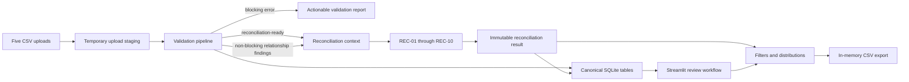

# Architecture

## System boundary

KZ EcomOps Control Tower is a local, single-user Streamlit application for a
deterministic order-reconciliation MVP. It accepts five canonical CSV files,
validates them, runs REC-01 through REC-10, persists canonical records and
anomalies in SQLite, and presents and exports operational findings. It does not
call platform APIs and does not require a network connection during normal use.

The upload staging directory is temporary and deleted automatically. The only
durable runtime artifact is the ignored local database at
`.runtime/kz-ecomops-control-tower.sqlite3`.

## Package responsibilities

| Component | Responsibility | Does not own |
| --- | --- | --- |
| `validation` | Immutable schemas, safe CSV reading, value/integrity/uniqueness checks, relationship findings and readiness reports. | Normalization, REC decisions, persistence or UI rendering. |
| `normalization` | Maps simulated Shopify, WooCommerce, Amazon and eBay exports into the canonical five-file model. | Validation decisions or anomaly rules. |
| `reconciliation` | Immutable domain models, one-pass indexes, explicit configuration and REC-01–REC-10 evaluation. | File upload, widgets or database connections. |
| `storage` | Transactional and idempotent SQLite persistence for canonical rows, anomalies and review status. | Rule evaluation or UI state. |
| `reporting` | Stable anomaly distributions and spreadsheet-safe, in-memory CSV exports. | Filtering widget state or file writes. |
| `ui` | Upload lifecycle, explicit run controls, presentation, filtering and thin adapters to public business/storage APIs. | Duplicated validation or REC logic. |
| `sample_data` | Deterministic public fixtures and manifest verification. | Runtime customer data. |
| `scripts` | Reproducible performance and repository-quality checks. | Application business features. |

## Canonical data model

The common order identity is `platform:source_order_id`. Every canonical file
retains `platform`, `source_order_id` and `order_id` so source relationships stay
traceable.

| File | Purpose | Primary business identifiers |
| --- | --- | --- |
| `orders.csv` | Order state, totals, currency and lifecycle dates. | `order_id`; `(platform, source_order_id)` |
| `payments.csv` | Provider payment attempts, successes and reversals. | `payment_id`, optional `provider_transaction_id` |
| `shipments.csv` | Fulfilment state, tracking and shipment dates. | `shipment_id` |
| `returns.csv` | Return state, received date and optional expected refund. | `return_id` |
| `refunds.csv` | Confirmed or unsuccessful refund movements. | `refund_id`, optional `provider_refund_id` |

All values remain strings through validation. Monetary parsing uses `Decimal`,
demonstration data is EUR-only, and date-times require an ISO 8601 timezone.
Order-item, product, inventory, advertising and traffic files are not required by
this MVP.

## Validation model

Validation is ordered so later stages never present unreliable partial output:

1. safe UTF-8/BOM reading and exact CSV record width;
2. required columns and structural correctness;
3. cell values, allowed statuses, EUR, decimals and timezone-aware dates;
4. row integrity, such as `order_id` composition and status-dependent dates;
5. blocking uniqueness for order, shipment and return identities;
6. non-blocking cross-file relationship findings.

Structural, value, integrity and blocking uniqueness issues reject affected rows
and prevent reconciliation. Payment/refund duplicates and missing or inconsistent
cross-file references are deliberately retained. They are business anomalies for
REC-04, REC-09 or REC-10, not import damage. A shipped record with blank tracking
is likewise retained for REC-05.

## Reconciliation engine

`ReconciliationContext` snapshots canonical strings and builds the shared lookup
indexes once. The ten rules are pure evaluations over that context, an explicit
timezone-aware `reference_at`, and immutable `ReconciliationConfig` values.

| Rule | Decision |
| --- | --- |
| REC-01 | Confirmed net payment differs from order total beyond tolerance. |
| REC-02 | Fully paid, non-cancelled order exceeds the shipping time limit. |
| REC-03 | Shipment departed without sufficient confirmed net payment. |
| REC-04 | Payment or provider transaction identifiers are duplicated. |
| REC-05 | Shipped or delivered shipment has blank tracking. |
| REC-06 | Cancelled order has a shipped or delivered shipment. |
| REC-07 | Overdue received return lacks a sufficient unambiguous refund. |
| REC-08 | Confirmed refunds exceed confirmed net payments beyond tolerance. |
| REC-09 | Refund or provider refund identifiers are duplicated. |
| REC-10 | Required cross-system references or event records are missing. |

The engine never reads the current clock implicitly. Exact monetary boundaries
use the configured `Decimal("0.01")` default; time boundaries use 48 hours and
seven days by default. These values are configuration, not duplicated rule code.

### Deterministic anomaly identity

An `anomaly_id` is a SHA-256-derived identifier built from stable business
identity: rule, anomaly discriminator, business values and source record
identifiers. Reference argument order and DataFrame row order do not affect it.
`row_number` remains in `RecordReference` for current-run traceability but is not
part of stable identity. Semantically identical findings are grouped; incompatible
business payloads are never silently merged. This makes SQLite persistence
idempotent even when source rows are reordered.

### RuleNotEvaluated

When missing, conflicting or ambiguous data makes a conclusion unsafe, the
engine emits `RuleNotEvaluated` instead of guessing or returning zero. It records
the rule, reason and relevant record references separately from confirmed
anomalies. Examples include a partial refund whose required expected amount is
unknown and a refund without `return_id` that could belong to multiple returns.

## SQLite lifecycle

Canonical rows use deterministic technical keys, and repeated imports update or
reuse those keys instead of multiplying data. Reconciliation anomaly upserts
preserve first detection, refresh last detection and current row references, and
retain a human review status (`open`, `in_review`, `resolved`, or `dismissed`).
Changing review status updates only the anomaly record; source DataFrames and CSV
files remain unchanged. Transactions roll back as a unit on failure.

Cross-file foreign keys are intentionally not blocking because REC-10 must retain
and analyze orphan records. This is a deliberate reconciliation trade-off, not a
loss of referential checks.

## UI, reporting and export boundary

Streamlit coordinates public functions and renders their immutable results. It
does not calculate REC conditions. Upload or configuration changes invalidate
stale reconciliation state and disable outdated downloads. The UI shows text
labels for severity and availability so meaning does not depend on color.

Reporting calculates complete and filtered distributions by anomaly code,
severity, platform and review status. CSV export is built entirely in memory,
uses a fixed column order, includes result configuration and references, emits a
UTF-8 BOM, and neutralizes spreadsheet formula prefixes in text cells. It never
writes an export file to the repository or runtime directory.

## Decisions and trade-offs

- Local SQLite keeps setup small and makes a technical demo reproducible, but it
  is not a multi-user database.
- Canonical CSV uploads avoid API credentials and changing third-party contracts,
  but imports are manual.
- `Decimal` and ISO 8601 strings prioritize correctness and auditability over
  compact numeric storage.
- Order-level aggregation supports partial operational events only at total-order
  level; item-level allocation is intentionally deferred.
- Explicit reference time makes tests and demonstrations deterministic, while the
  user must choose an appropriate operational cut-off.

## Outside the MVP

Real platform APIs, scheduled synchronization, authentication, roles, cloud
deployment, automatic operational decisions, foreign-exchange conversion,
item-level partial reconciliation, full KPI analytics, inventory optimization,
demand forecasting, advertising/traffic analytics and multi-user workflows are
outside this release.
